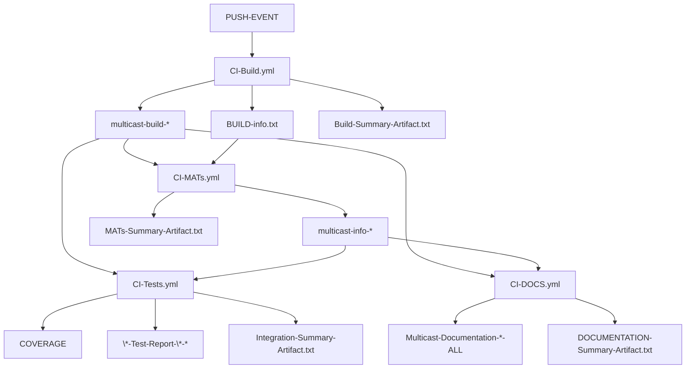
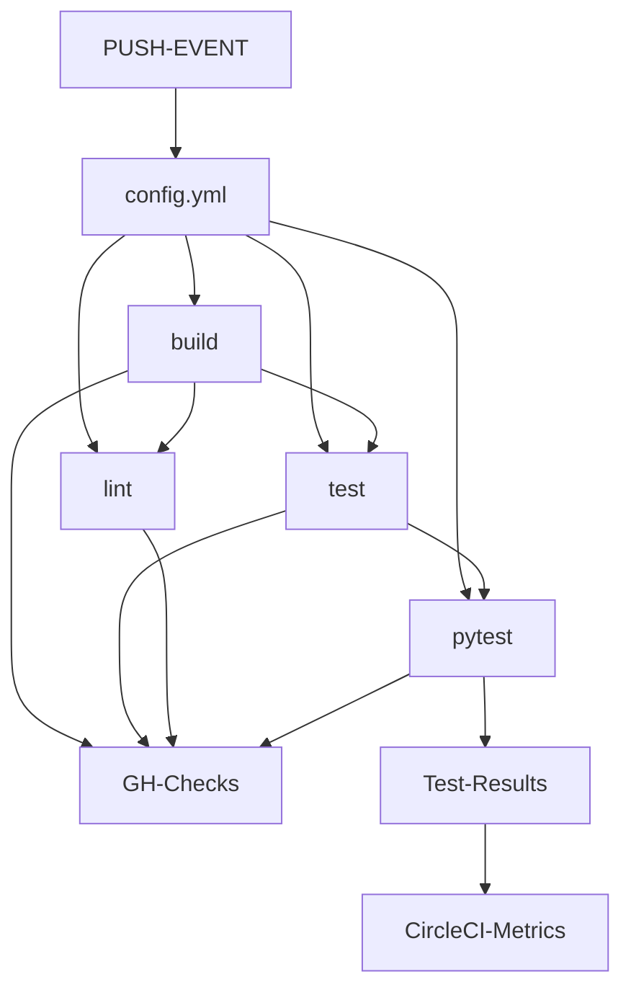
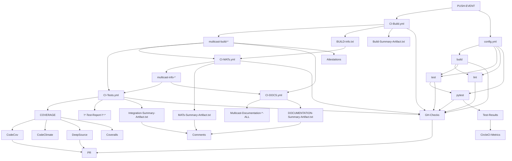
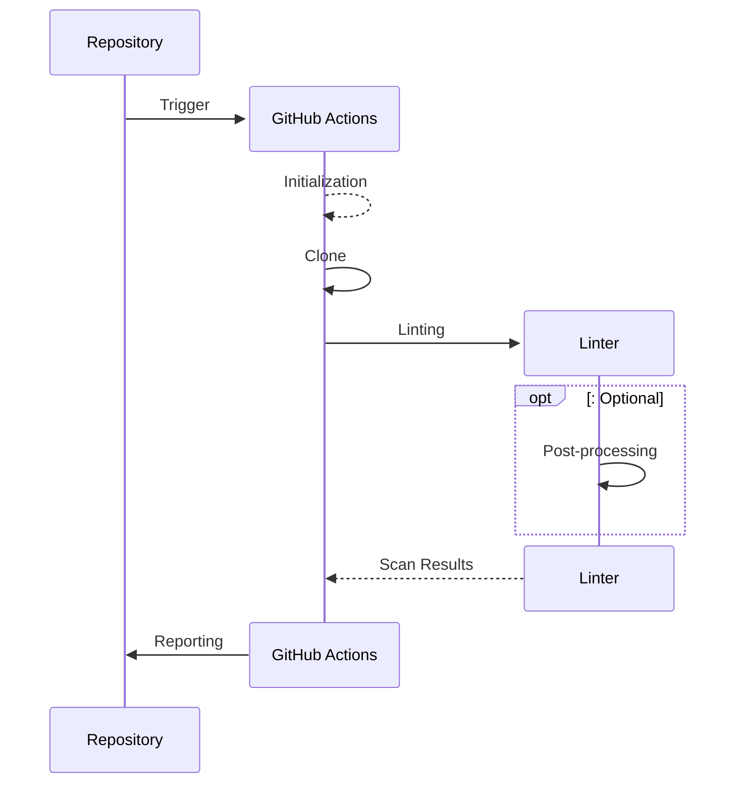

# CI

Continuous Integration details for the Multicast project.

## Service providers

***

Continuous integration testing for the Multicast project is handled by
[GitHub Actions](https://github.com/reactive-firewall/multicast/actions) and the
generous [CircleCI service](https://app.circleci.com/pipelines/github/reactive-firewall/multicast).

[GitHub Actions Metrics](https://github.com/reactive-firewall/multicast/actions/metrics/performance?dateRangeType=DATE_RANGE_TYPE_LAST_90_DAYS&tab=runner)
**CircleCI**
[](https://app.circleci.com/insights/github/reactive-firewall/multicast/workflows/test-matrix/overview?branch=master&reporting-window=last-90-days&insights-snapshot=true)

Many additional services are used for enhancing CI/CD with additional metrics, insights, and
automated analysis.

[](https://app.deepsource.com/gh/reactive-firewall/multicast/)
[](https://codecov.io/gh/reactive-firewall/multicast)
[](https://app.deepsource.com/report/3f7c11ca-c203-44ec-9e01-126078f11660)

[](https://isitmaintained.com/project/reactive-firewall/multicast "Average time to resolve an issue")
[](https://isitmaintained.com/project/reactive-firewall/multicast "Percentage of issues still open")

## Testing in CI/CD

***

### Acceptance Testing with GitHub Actions

#### How on-`workflow_run` triggers propagate



1. **PUSH-EVENT**: This event triggers the entire Acceptance Testing CI/CD workflow.
1. [CI-Build.yml](https://github.com/reactive-firewall/multicast/tree/HEAD/.github/workflows/CI-BUILD.yml): The main configuration file for the build process, which generates several artifacts:
   1. multicast-build-`{{ sha }}`: The built package artifact.
   1. BUILD-info.txt: Contains essential details about the build execution, including:
      1. Build Run ID: A unique identifier for the build run.
      1. Build Artifact's ID/URL/Name/Digest: Information about the generated artifact, such as its identifier, location, name, and digest for verification.
      1. Git Commit Info: Details about the commit associated with the build, including the SHA, reference, and branch.
   1. Build-Summary-Artifact.txt (BUILD-COMMENT-BODY-`{{ sha }}`): A summary of the build process, highlighting key outcomes and metrics.
1. [CI-MATs.yml](https://github.com/reactive-firewall/multicast/tree/HEAD/.github/workflows/CI-MATs.yml): A configuration file that processes the build artifacts to create:
   1. multicast-info.txt (multicast-info-`{{ build_sha }}`): Contains all the information from the "Build-Info.txt" along with additional details about the "CI-MATs.yml" workflow run, including:
      1. MATs Workflow Run ID: A unique identifier for the MATs workflow run.
      1. Conclusion Statuses: The outcomes of the Minimal Acceptance Tests.
   1. MATs-Summary-Artifact.txt (MATS-COMMENT-BODY-`{{ build_sha }}`): A summary of the Minimal Acceptance Tests conducted.
1. [CI-Tests.yml](https://github.com/reactive-firewall/multicast/tree/HEAD/.github/workflows/Tests.yml): A configuration file for executing tests, which processes the build artifacts to create:
   1. Coverage reports: Uploading various coverage reports for the tests executed to multiple services for analysis (eg. codecov.io, codeclimate.com, app.deepsource.io, etc.).
   1. Test-Results-Artifacts (`{{ test-group }}`-Test-Report-`{{ matrix.os }}`-`{{ matrix.python-version }}`): Contains the results of the tests grouped by `coverage|doctests|integration`, `os` and `python-version`.
   1. Integration-Summary-Artifact.txt (INTEGRATION-COMMENT-BODY-`{{ build_sha }}`): A summary of the test results.
1. [CI-DOCs.yml](https://github.com/reactive-firewall/multicast/tree/HEAD/.github/workflows/CI-DOCS.yml): A configuration file for generating documentation, which produces:
   1. Documentation-Artifact.zip (Multicast-Documentation-`{{ build_sha }}`-ALL): A zip file containing the generated documentation.
   1. DOCUMENTATION-Summary-Artifact.txt (DOCUMENTATION-COMMENT-BODY-`{{ build_sha }}`): A summary of the documentation results.

In summary, as the diagram illustrates, a GitHub Actions CI/CD workflow begins with a push event, leading to the building of artifacts, the execution of Minimal Acceptance Tests, and the generation of test reports. The workflow includes passing detailed information about the build process, such as the build run ID, artifact details, and associated git commit information, as well as comprehensive details about the Minimal Acceptance Tests, including the MATs workflow run ID and conclusion statuses, ensuring thorough traceability and accountability throughout the CI/CD pipeline.

### Acceptance Testing with CircleCI

While the comprehensive results from the exstensive GHA pipeline offers a detailed look at the
state of the codebase, the process can take upwards of 30 minutes to compleate. The Multicast
Project also utilizes the much faster CircleCI offering to provide pass or fail status much earlier
in CI/CD. While the underlying tests are the same for both GHA and CircleCI, they are only tested
in a single environment on CircleCI, and typicly perform faster.



1. **PUSH-EVENT**: This event triggers the entire Acceptance Testing CI/CD workflow.
1. [config.yml](https://github.com/reactive-firewall/multicast/tree/HEAD/.circleci/config.yml): The sole configuration file for the CircleCI jobs:
   1. build: Tests that the build process works without critical error, (albeit these quick builds are ephemral and not attested)
   1. test: Tests that the Minimal Acceptance tests pass without failure, (albeit the test details are discarded, only the logs remain for a while on CircleCI)
   1. lint: Selectivly lints (See Linting for details) the multicast python source (eg. `multicast/*.py`), failing on any linter flagged issues or passing on none.
   1. pytest: Runs the now deprecated `make test-pytest` target to discover, and then run, unittests via the `pytest` testing framework.
      1. **Test-Results**: the produced test results. See [Collect Tests with CircleCI](https://circleci.com/docs/collect-test-data/#pytest) for more.
1. **GH-Checks**: Each CI/CD job will report back a GitHub Check run result.

In summary, as the diagram illustrates, a CircleCI pipeline CI/CD workflow begins with a push event, leading to the build, test, lint, and pytest jobs reporting back to GitHub Checks, indicating the status of each job. Additionally, the output from pytest generates some Test Results, which are then used to produce CircleCI Metrics.

### How Integrations are triggered from Testing in CI/CD

#### Key integrations

There are many integrations with various service providers used in the Multicast Project's CI/CD pipeline.



***

## Linting in CI/CD

### TL;DR Context of Linting

> From Wikipedia, the free encyclopedia
>
> [Lint](https://en.wikipedia.org/wiki/Lint_(software)) is the computer science term for a static code analysis tool used to flag programming errors, bugs, stylistic errors and suspicious constructs.[[4]](https://en.wikipedia.org/wiki/Lint_(software)#cite_note-4) The term originates from a Unix utility that examined C language source code.[[1]](https://en.wikipedia.org/wiki/Lint_(software)#cite_note-BellLabs-1) A program which performs this function is also known as a "linter".

In the constantly evolving ecosystem of software development, where code quality and maintainability matter, the role of linters has become increasingly common practice. So it should be no surprise that various linters are used in the Multicast project's CI/CD workflows. By incorporating the linting directly into the CI/CD workflows, this automation alleviates the load on developers to manually check much of the code style and formatting across various languages, including Python, YAML, Makefile, Bash, and Markdown.

Some of Multicast Project styles and conventions are quite specific (eg. custom locking conventions of [CEP-5](https://gist.github.com/reactive-firewall/3d2bd3cf37f87974df6f7bee31a05a89)), and not yet automated. However, by leveraging linters, we not only ensure a level of maintainability but also foster a collaborative environment where developers can focus on writing effective code rather than getting bogged down by stylistic concerns.

### Linting Design Overview

#### Linting phases

The generalized design of linter workflows in the Multicast Project CI/CD pipeline follows the following phases:

  * **initialization** - Bootstraps environment and any initial setup automatically
  * **clone** - git clone the Multicast Git Repository and any submodules needed
  * **Linting** - performs the actual linting on the resulting clone
  * **Post-processing** (optional) - any post-processing of the resulting linting results
  * **Reporting** - report any results and/or linting status

> [!IMPORTANT]
> This overview does not address the complexities of CI/CD timing, concurrency, or the various combinations of linter workflows that run simultaneously. Each linter workflow is separately triggered (eg. push versus PR, etc.) and thus _logicly_ disjoint (See CI/CD Triggering for details). Each linter workflow varies in its exact implementation of the afore mentioned phases.

Logically (eg. ignoring complexities of concurrency and trigger conditionals, etc.) the order of phases are sequential per single linter.



***

## Configurable CI Variables

This section documents environment variables used across CI workflows to ensure consistency and
simplify maintenance.

### Python Version Variables

To standardize Python version management across all CI workflows, we use a set of environment
variables defined at the top of each workflow file. This approach centralizes version definitions
while maintaining separation between workflows, making future updates easier and ensuring
consistency.

#### Standard Python Version Variables

| Variable | Purpose | Example Value |
|----------|---------|---------------|
| `PYTHON_DEFAULT` | The default Python version used for single-version jobs | `"3.12"` |
| `PYTHON_OLD_MIN` | Oldest/minimum Python version for cross-python portability testing | `"3.10"` |
| `PYTHON_OLD_EXTRA` | Additional Python version for coverage testing | `"3.11"` |
| `PYTHON_EXPERIMENTAL` | Future/experimental Python version for optional testing | `"3.13"` |

#### Usage Examples

##### Setting up Python with the default version

```yaml
- uses: actions/setup-python@v5
  with:
    python-version: "${{ vars.PYTHON_DEFAULT }}"
```

##### Using matrix strategy for multi-version testing

```yaml
jobs:
  test:
    strategy:
      fail-fast: false
      matrix:
        python-version: ["${{ vars.PYTHON_DEFAULT }}", "${{ vars.PYTHON_EXPERIMENTAL }}"]
    steps:
      - uses: actions/setup-python@v5
        with:
          python-version: ${{ matrix.python-version }}
```

***

#### Copyright (c) 2021-2025, Mr. Walls

[](https://github.com/reactive-firewall/multicast/blob/stable/LICENSE.md)
