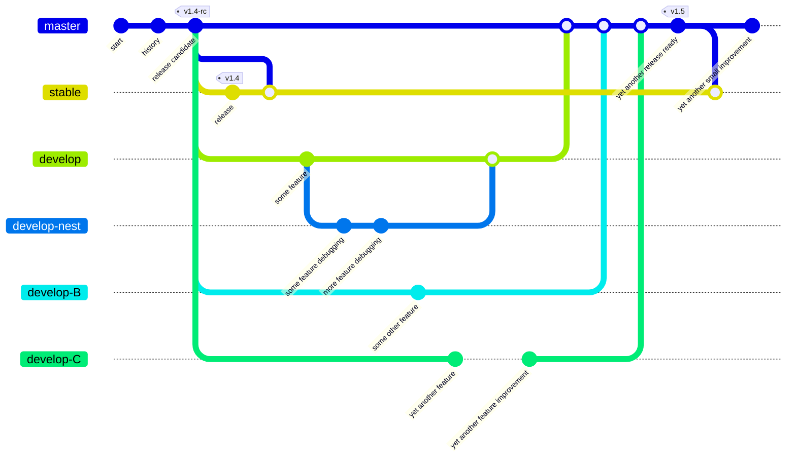

# CI

## Service providers

***

Continuous integration testing is handled by GitHub Actions and the generous CircleCI service.

[](https://app.circleci.com/insights/github/reactive-firewall/multicast/workflows/test-matrix/overview?branch=master&reporting-window=last-90-days&insights-snapshot=true)
[](https://app.deepsource.com/gh/reactive-firewall/multicast/)
[](https://codecov.io/gh/reactive-firewall/multicast)
[](https://app.deepsource.com/report/3f7c11ca-c203-44ec-9e01-126078f11660)
[GHA Metrics](https://github.com/reactive-firewall/multicast/actions/metrics/performance?dateRangeType=DATE_RANGE_TYPE_LAST_90_DAYS)

[](https://isitmaintained.com/project/reactive-firewall/multicast "Average time to resolve an issue")
[](https://isitmaintained.com/project/reactive-firewall/multicast "Percentage of issues still open")

## Configurable CI Variables

This section documents environment variables used across CI workflows to ensure consistency and
simplify maintenance.

### Python Version Variables

To standardize Python version management across all CI workflows, we use a set of environment
variables defined at the top of each workflow file. This approach centralizes version definitions
while maintaining separation between workflows, making future updates easier and ensuring
consistency.

#### Standard Python Version Variables

| Variable | Purpose | Example Value |
|----------|---------|---------------|
| `PYTHON_DEFAULT` | The default Python version used for single-version jobs | `"3.12"` |
| `PYTHON_OLD_MIN` | Oldest/minimum Python version for cross-python portability testing | `"3.10"` |
| `PYTHON_OLD_EXTRA` | Additional Python version for coverage testing | `"3.11"` |
| `PYTHON_EXPERIMENTAL` | Future/experimental Python version for optional testing | `"3.13"` |

#### Usage Examples

##### Setting up Python with the default version

```yaml
- uses: actions/setup-python@v5
  with:
    python-version: "${{ vars.PYTHON_DEFAULT }}"
```

##### Using matrix strategy for multi-version testing

```yaml
jobs:
  test:
    strategy:
      fail-fast: false
      matrix:
        python-version: ["${{ vars.PYTHON_DEFAULT }}", "${{ vars.PYTHON_EXPERIMENTAL }}"]
    steps:
      - uses: actions/setup-python@v5
        with:
          python-version: ${{ matrix.python-version }}
```

## Testing

***

> [!IMPORTANT]
> Testing is initiated with the bash command: `make test-pytest` or just `make test`
> and can be reset before and after with: `make clean` and `make purge`

You can find all the testing code in the aptly named `tests/` directory.

* Unit-testing is primarily done with the `unittest` framework.
* Functional testing is done via additional checks, including an end-to-end check invoking an
  actual pair of processes to test that `SAY` and `HEAR` indeed work together.

### MATs

Minimal acceptance testing is run across multiple versions of Python to ensure stable behavior
across a wide range of environments. MATs are also automated as part of the CI processes, and run
for each push to the repository.
Feature development and non-security related bug fixes are done on development branches and
then merged into the
[default branch (master)](https://github.com/reactive-firewall/multicast/blob/master/) for further
integration testing. This ensures the
[release branch (stable)](https://github.com/reactive-firewall/multicast/blob/stable/) remains
acceptable for production use.



### Linting

The Multicast project uses CI/CD to ensure all files, including code, configurations, and
documentation, are linted before publishing releases. This is automatically triggered by
pull requests during the project's release workflow, namely before merging anything to the
branch `master`.

#### Linting Badges

[](https://github.com/reactive-firewall/multicast/actions/workflows/codeql-analysis.yml)
[](https://github.com/reactive-firewall/multicast/actions/workflows/markdown-lint.yml)
[](https://github.com/reactive-firewall/multicast/actions/workflows/yaml-lint.yml)
[](https://github.com/reactive-firewall/multicast/actions/workflows/makefile-lint.yml)

### As a Dependency, Testing

> [!TIP]
> In a rush to get this module working? Then try using this in your own test workflow

```bash
#cd /MY-AWESOME-DEV-PATH/multicast || git clone ...
make clean ; # cleans up from any previous tests hopefully
make test ; # runs the tests
make clean ; # cleans up for next test
```

> [!TIP]
> Use PEP8 to check python code style? Great! Try this:

```bash
make clean ; # cleans up from any previous tests hopefully
make test-style ; # runs the project's tests for style
make clean ; # cleans up for next test
```

***

#### Copyright (c) 2021-2025, Mr. Walls

[MIT License](https://github.com/reactive-firewall/multicast/blob/stable/LICENSE.md)
