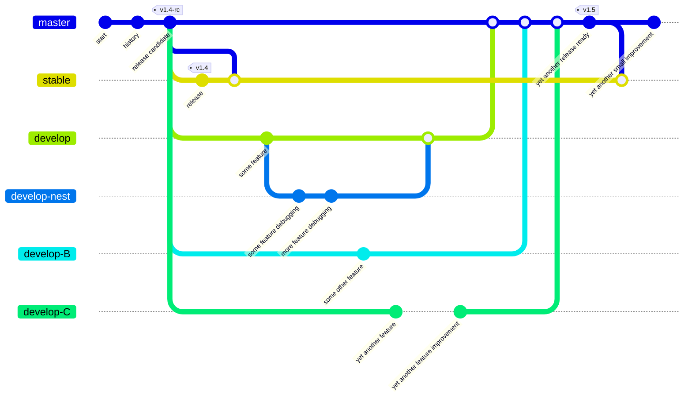

# CI

## Service providers

***

Continuous integration testing is handled by GitHub Actions and the generous CircleCI service.

[](https://app.circleci.com/insights/github/reactive-firewall/multicast/workflows/workflow/overview?branch=master&reporting-window=last-90-days&insights-snapshot=true)
[](https://app.deepsource.com/gh/reactive-firewall/multicast/)
[](https://codecov.io/gh/reactive-firewall/multicast)
[](https://app.deepsource.com/report/3f7c11ca-c203-44ec-9e01-126078f11660)

## Testing

***

> [!IMPORTANT]
> Testing is initiated with the bash command: `make test-pytest` or just `make test`
> and can be reset before and after with: `make clean` and `make purge`

You can find all the testing code in the aptly named `tests/` directory.

* Unit-testing is primarily done with the `unittest` framework.
* Functional testing is done via additional checks, including an end-to-end check invoking an
  actual pair of processes to test that `SAY` and `HEAR` indeed work together.

### MATs

Minimal acceptance testing is run across multiple versions of Python to ensure stable behavior
across a wide range of environments. MATs are also automated as part of the CI processes, and run
for each push to the repository.
Feature development and non-security related bug fixes are done on development branches and
then merged into the
[default branch (master)](https://github.com/reactive-firewall/multicast/blob/master/) for further
integration testing. This ensures the
[release branch (stable)](https://github.com/reactive-firewall/multicast/blob/stable/) remains
acceptable for production use.



### As a Dependency, Testing

> [!TIP]
> In a rush to get this module working? Then try using this in your own test workflow

```bash
#cd /MY-AWESOME-DEV-PATH/multicast || git clone ...
make clean ; # cleans up from any previous tests hopefully
make test ; # runs the tests
make clean ; # cleans up for next test
```

> [!TIP]
> Use PEP8 to check python code style? Great! Try this:

```bash
make clean ; # cleans up from any previous tests hopefully
make test-style ; # runs the project's tests for style
make clean ; # cleans up for next test
```

***

#### Copyright (c) 2021-2025, Mr. Walls

[MIT License](https://github.com/reactive-firewall/multicast/blob/stable/LICENSE.md)
