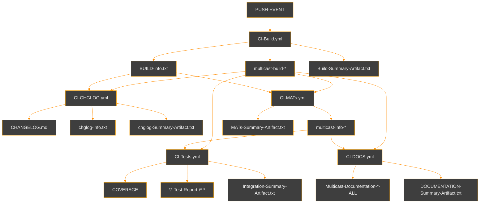
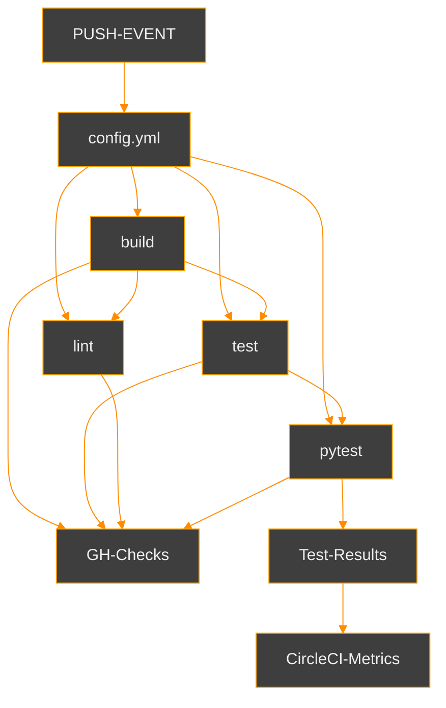
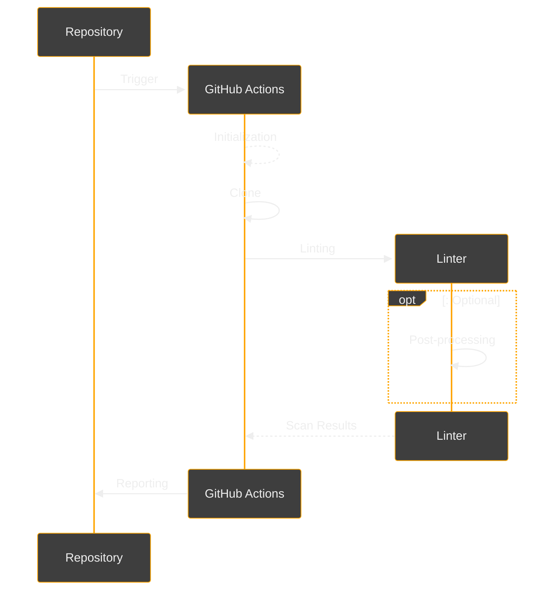
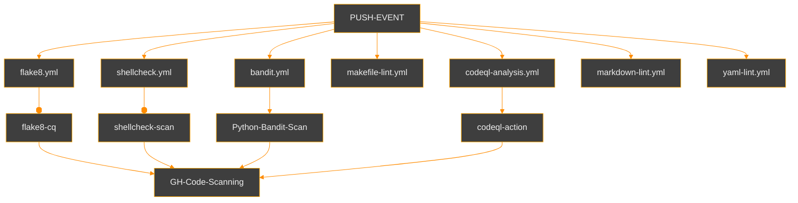

```mermaid
%%{ init: { 'theme': 'base', 'themeVariables': { 'darkMode': true, 'primaryColor': '#3e3e3e', 'background': 'transparent', 'primaryBorderColor': 'Orange', 'lineColor': 'darkOrange', 'secondaryColor': 'transparent', 'tertiaryColor': '#030303' }} }%%
graph TD;
  PUSH-EVENT["PUSH EVENT"];
  PUSH-EVENT-->CI-Build.yml;
  PUSH-EVENT-->config.yml;

  subgraph GHA
  multicast-build-*@{ shape: card };
  BUILD-info.txt@{ shape: card };
  Build-Summary-Artifact.txt@{ shape: card };
  CI-Build.yml-->multicast-build-* & BUILD-info.txt & Build-Summary-Artifact.txt;
  multicast-build-*-->CI-MATs.yml;
  multicast-build-*-->CI-CHGLOG.yml;
  BUILD-info.txt-->CI-MATs.yml;
  BUILD-info.txt-->CI-CHGLOG.yml;
  CHANGELOG.md@{ shape: card };
  chglog-info.txt@{ shape: card };
  chglog-Summary-Artifact.txt@{ shape: card };
  CI-CHGLOG.yml-->CHANGELOG.md;
  CI-CHGLOG.yml-->chglog-info.txt;
  CI-CHGLOG.yml-->chglog-Summary-Artifact.txt;
  multicast-info-*@{ shape: card };
  MATs-Summary-Artifact.txt@{ shape: card };
  CI-MATs.yml-->multicast-info-* & MATs-Summary-Artifact.txt;
  multicast-build-*-->CI-Tests.yml & CI-DOCS.yml;
  multicast-info-*-->CI-Tests.yml & CI-DOCS.yml;
  DOCUMENTATION-Summary-Artifact.txt@{ shape: card };
  Integration-Summary-Artifact.txt@{ shape: card };
  Multicast-Documentation-*-ALL@{ shape: card };
  \*-Test-Report-\*-*@{ shape: card };
  CI-Tests.yml-->Integration-Summary-Artifact.txt;
  CI-DOCS.yml-->DOCUMENTATION-Summary-Artifact.txt & Multicast-Documentation-*-ALL;
  CI-Tests.yml-->\*-Test-Report-\*-* & COVERAGE;
  PUSH-EVENT-->markdown-lint.yml & yaml-lint.yml;
  PUSH-EVENT-->bandit.yml & codeql-analysis.yml & flake8.yml & makefile-lint.yml;
  PUSH-EVENT-->shellcheck.yml;
  end

  subgraph "Github Attestations"
  multicast-build-*-->Attestations;
  end

  subgraph "Github Commit Comments"
  Build-Summary-Artifact.txt-->Comments;
  chglog-Summary-Artifact.txt-->Comments;
  MATs-Summary-Artifact.txt-->Comments;
  Integration-Summary-Artifact.txt-->Comments;
  DOCUMENTATION-Summary-Artifact.txt-->Comments;
  end

  subgraph "3rd-Party Integrations"

  subgraph "CodeCov service"
  CodeCov-->CodeCov-Metrics;
  end

  subgraph "DeepSource service"
  DeepSource-->DeepSource-Metrics;
  end

  subgraph "Coveralls service"
  Coveralls-->Coveralls-Metrics;
  end

  COVERAGE-->CodeCov & DeepSource & Coveralls;

  subgraph "GHA Marketplace"
  bandit.yml--oPython-Bandit-Scan;
  codeql-analysis.yml--ocodeql-action;
  flake8.yml--oflake8-cq;

  shellcheck.yml--oshellcheck-scan;
  end

  end

  subgraph "Github Checks"
  CI-Build.yml-->GH-Checks;
  CI-MATs.yml-->GH-Checks;
  CI-Tests.yml-->GH-Checks;
  CI-DOCS.yml-->GH-Checks;
  markdown-lint.yml-->GH-Checks;
  makefile-lint.yml-->GH-Checks;
  yaml-lint.yml-->GH-Checks;
  bandit.yml-->GH-Checks;
  codeql-analysis.yml-->GH-Checks;
  flake8.yml-->GH-Checks;
  shellcheck.yml-->GH-Checks;

  CodeCov-->GH-Checks;
  DeepSource-->GH-Checks;
  end

  subgraph "GitHub Code Scanning"
  Python-Bandit-Scan-->GH-Code-Scanning;
  codeql-action-->GH-Code-Scanning;
  flake8-cq-->GH-Code-Scanning;
  shellcheck-scan-->GH-Code-Scanning;
  end

  subgraph CircleCI
  config.yml-->build;
  config.yml-->test;
  config.yml-->lint;
  config.yml-->pytest;
  build-->lint;
  build-->test;
  test-->pytest;

  build-->GH-Checks;
  test-->GH-Checks;
  lint-->GH-Checks;
  pytest-->GH-Checks;
  pytest-->Test-Results;

  Test-Results-->CircleCI-Metrics;
  end

  subgraph PR
  PRC["GitHub Pull-Request Comments"]
  GH-Checks-->PRC;
  GH-Code-Scanning-->PRC;
  CodeCov-->PRC;
  DeepSource-->PRC;
  end
```

# CI

Continuous Integration details for the Multicast project.

## CI Service Providers

***

Continuous integration testing for the Multicast project is handled by
[GitHub Actions](https://github.com/reactive-firewall-org/multicast/actions) and the
generous [CircleCI service](https://app.circleci.com/pipelines/github/reactive-firewall-org/multicast).

### CI/CD Metrics

#### GitHub

[GitHub Actions Metrics](https://github.com/reactive-firewall-org/multicast/actions/metrics/performance?dateRangeType=DATE_RANGE_TYPE_LAST_90_DAYS&tab=runner)

#### CircleCI

[](https://app.circleci.com/insights/github/reactive-firewall-org/multicast/workflows/test-matrix/overview?branch=master&reporting-window=last-90-days&insights-snapshot=true)

#### Other Metrics

Many additional services are used for enhancing CI/CD with additional metrics, insights, and
automated analysis.

[](https://app.deepsource.com/gh/reactive-firewall-org/multicast/)
[](https://codecov.io/gh/reactive-firewall-org/multicast)
[](https://app.deepsource.com/report/3f7c11ca-c203-44ec-9e01-126078f11660)

[](https://isitmaintained.com/project/reactive-firewall-org/multicast "Average time to resolve an issue")
[](https://isitmaintained.com/project/reactive-firewall-org/multicast "Percentage of issues still open")

## Triggering CI/CD

***

### GitHub Actions

| Triggers | Workflows |
|--------|--------|
| `push` | [`.github/workflows/bandit.yml`](https://github.com/reactive-firewall-org/multicast/tree/HEAD/.github/workflows/bandit.yml), [`.github/workflows/CI-BUILD.yml`](https://github.com/reactive-firewall-org/multicast/tree/HEAD/.github/workflows/CI-BUILD.yml), [`.github/workflows/codeql-analysis.yml`](https://github.com/reactive-firewall-org/multicast/tree/HEAD/.github/workflows/codeql-analysis.yml), [`.github/workflows/makefile-lint.yml`](https://github.com/reactive-firewall-org/multicast/tree/HEAD/.github/workflows/makefile-lint.yml), [`.github/workflows/markdown-lint.yml`](https://github.com/reactive-firewall-org/multicast/tree/HEAD/.github/workflows/markdown-lint.yml), [`.github/workflows/shellcheck.yml`](https://github.com/reactive-firewall-org/multicast/tree/HEAD/.github/workflows/shellcheck.yml), [`.github/workflows/yaml-lint.yml`](https://github.com/reactive-firewall-org/multicast/tree/HEAD/.github/workflows/yaml-lint.yml) |
| `workflow_run` | [`.github/workflows/CI-CHGLOG.yml`](https://github.com/reactive-firewall-org/multicast/tree/HEAD/.github/workflows/CI-CHGLOG.yml), [`.github/workflows/CI-MATs.yml`](https://github.com/reactive-firewall-org/multicast/tree/HEAD/.github/workflows/CI-MATs.yml), [`.github/workflows/CI-DOCS.yml`](https://github.com/reactive-firewall-org/multicast/tree/HEAD/.github/workflows/CI-DOCS.yml), [`.github/workflows/Tests.yml`](https://github.com/reactive-firewall-org/multicast/tree/HEAD/.github/workflows/Tests.yml) |
| `pull_request` | [`.github/workflows/bandit.yml`](https://github.com/reactive-firewall-org/multicast/tree/HEAD/.github/workflows/bandit.yml), [`.github/workflows/codeql-analysis.yml`](https://github.com/reactive-firewall-org/multicast/tree/HEAD/.github/workflows/codeql-analysis.yml), [`.github/workflows/makefile-lint.yml`](https://github.com/reactive-firewall-org/multicast/tree/HEAD/.github/workflows/makefile-lint.yml), [`.github/workflows/markdown-lint.yml`](https://github.com/reactive-firewall-org/multicast/tree/HEAD/.github/workflows/markdown-lint.yml), [`.github/workflows/shellcheck.yml`](https://github.com/reactive-firewall-org/multicast/tree/HEAD/.github/workflows/shellcheck.yml), [`.github/workflows/yaml-lint.yml`](https://github.com/reactive-firewall-org/multicast/tree/HEAD/.github/workflows/yaml-lint.yml) |
| `pull_request_target` | [`.github/workflows/Labeler.yml`](https://github.com/reactive-firewall-org/multicast/tree/HEAD/.github/workflows/Labeler.yml) |
| `schedule` | [`.github/dependabot.yml`](https://github.com/reactive-firewall-org/multicast/tree/HEAD/.github/dependabot.yml), [`.github/workflows/codeql-analysis.yml`](https://github.com/reactive-firewall-org/multicast/tree/HEAD/.github/workflows/codeql-analysis.yml), [`.github/workflows/scorecard.yml`](https://github.com/reactive-firewall-org/multicast/tree/HEAD/.github/workflows/scorecard.yml) |
| `release` | [`.github/workflows/CD-PyPi.yml`](https://github.com/reactive-firewall-org/multicast/tree/HEAD/.github/workflows/CD-PyPi.yml) |

### CircleCI Pipelines

| Triggers | Pipelines |
|--------|--------|
| `push` (_via a webhook_) | [`.circleci/config.yml`](https://github.com/reactive-firewall-org/multicast/tree/HEAD/.circleci/config.yml) |

### Appveyor Jobs

> [!CAUTION]
> The Appveyor integration is still experimental, as the multicast module is not currently able to
> support running on Windows without Python socket support.

| Triggers | Jobs |
|--------|--------|
| `pull_request` (_via a webhook_) | [`.appveyor.yml`](https://github.com/reactive-firewall-org/multicast/tree/HEAD/.appveyor.yml) |

## Testing in CI/CD

***

### Acceptance Testing with GitHub Actions

#### How on-`workflow_run` triggers propagate



1. **PUSH-EVENT**: This event triggers the entire Acceptance Testing CI/CD workflow.
2. [CI-Build.yml](https://github.com/reactive-firewall-org/multicast/tree/HEAD/.github/workflows/CI-BUILD.yml):
The main configuration file for the build process, which generates several artifacts:
  A. multicast-build-`{{ sha }}`: The built package artifact.
  B. BUILD-info.txt: Contains essential details about the build execution, including:
    i. Build Run ID: A unique identifier for the build run.
    ii. Build Artifact's ID/URL/Name/Digest: Information about the generated artifact, such as its
    identifier, location, name, and digest for verification.
    iii. Git Commit Info: Details about the commit associated with the build, including the SHA,
    reference, and branch.
  C. Build-Summary-Artifact.txt (BUILD-COMMENT-BODY-`{{ sha }}`): A summary of the build process,
  highlighting key outcomes and metrics.
3. [CI-CHGLOG.yml](https://github.com/reactive-firewall-org/multicast/tree/HEAD/.github/workflows/CI-CHGLOG.yml):
A configuration file that processes the build info to create:
  A. CHANGELOG.md (multicast-chglog-`{{ build_sha }}`): The generated CHANGELOG document.
  B. chglog-info.txt (multicast-chglog-info-`{{ build_sha }}`): Contains all the information from
  the "Build-Info.txt" along with additional details about the "CI-CHGLOG.yml" workflow run,
  including:
    i. CHANGELOG Workflow Run ID: A unique identifier for the MATs workflow run.
    ii. CHANGELOG Artifact's ID/URL/Name/Digest: Information about the generated CHANGELOG.md
    artifact, such as its identifier, location, name, and digest for verification.
    iii. Git Commit Info: Details about the commit associated with the build, including the nearest
    TAG (e.g., release or pre-release), and the previous release used for comparing changes.
  C. chglog-Summary-Artifact.txt: A summary of the CHANGELOG generation process, highlighting key
  outcomes and metrics.
4. [CI-MATs.yml](https://github.com/reactive-firewall-org/multicast/tree/HEAD/.github/workflows/CI-MATs.yml):
A configuration file that processes the build artifacts to create:
  A. multicast-info.txt (multicast-info-`{{ build_sha }}`): Contains all the information from the
  "Build-Info.txt" along with additional details about the "CI-MATs.yml" workflow run, including:
    i. MATs Workflow Run ID: A unique identifier for the MATs workflow run.
    ii. Conclusion Statuses: The outcomes of the Minimal Acceptance Tests.
  B. MATs-Summary-Artifact.txt (MATS-COMMENT-BODY-`{{ build_sha }}`): A summary of the Minimal
  Acceptance Tests conducted.
5. [CI-Tests.yml](https://github.com/reactive-firewall-org/multicast/tree/HEAD/.github/workflows/Tests.yml):
A configuration file for executing tests, which processes the build artifacts to create:
  A. Coverage reports: Uploading various coverage reports for the tests executed to multiple
  services for analysis (e.g., codecov.io, coveralls.io, app.deepsource.io, etc.).
  B. Test-Results-Artifacts
  (`{{ test-group }}`-Test-Report-`{{ matrix.os }}`-`{{ matrix.python-version }}`):
  Contains the results of the tests grouped by `coverage|doctests|integration`, `os` and
  `python-version`.
  C. Integration-Summary-Artifact.txt (INTEGRATION-COMMENT-BODY-`{{ build_sha }}`): A summary of
  the test results.
6. [CI-DOCs.yml](https://github.com/reactive-firewall-org/multicast/tree/HEAD/.github/workflows/CI-DOCS.yml):
A configuration file for generating documentation, which produces:
  A. Documentation-Artifact.zip (Multicast-Documentation-`{{ build_sha }}`-ALL): A zip file
  containing the generated documentation.
  B. DOCUMENTATION-Summary-Artifact.txt (DOCUMENTATION-COMMENT-BODY-`{{ build_sha }}`): A summary
  of the documentation results.

In summary, as the diagram illustrates, a GitHub Actions CI/CD workflow begins with a push event,
leading to the building of artifacts, the execution of Minimal Acceptance Tests, and the generation
of test reports. The workflow includes passing detailed information about the build process, such
as the build run ID, artifact details, and associated git commit information, as well as
comprehensive details about the Minimal Acceptance Tests, including the MATs workflow run ID and
conclusion statuses, ensuring thorough traceability and accountability throughout the CI/CD
pipeline.

### Acceptance Testing with CircleCI

While the comprehensive results from the extensive GHA pipeline offer a detailed look at the
state of the codebase, the process can take upwards of 30 minutes to complete. The Multicast
Project also utilizes the much faster CircleCI offering to provide pass or fail status much earlier
in CI/CD. While the underlying tests are the same for both GHA and CircleCI, they are only tested
in a single environment on CircleCI, and typically perform faster.

#### How `push` triggers propagate on CircleCI



1. **PUSH-EVENT**: This event triggers the entire Acceptance Testing CI/CD workflow.
2. [config.yml](https://github.com/reactive-firewall-org/multicast/tree/HEAD/.circleci/config.yml): The
sole configuration file for the CircleCI jobs:
  A. build: Tests that the build process works without critical error, (albeit these quick builds
  are ephemeral and not attested)
  B. test: Tests that the Minimal Acceptance tests pass without failure, (albeit the test details
  are discarded, only the logs remain for a while on CircleCI)
  C. lint: Selectively lints (See Linting for details) the multicast python source (e.g.,
  `multicast/*.py`), failing on any linter flagged issues or passing on none.
  D. pytest: Runs the now deprecated `make test-pytest` target to discover, and then run,
  unittests via the `pytest` testing framework.
    i. **Test-Results**: the produced test results. See
    [Collect Tests with CircleCI](https://circleci.com/docs/collect-test-data/#pytest) for more.
3. **GH-Checks**: Each CI/CD job will report back a GitHub Check run result.

In summary, as the diagram illustrates, a CircleCI pipeline CI/CD workflow begins with a push
event, leading to the build, test, lint, and pytest jobs reporting back to GitHub Checks,
indicating the status of each job. Additionally, the output from pytest generates some Test
Results, which are then used to produce CircleCI Metrics.

### How Integrations are triggered from Testing in CI/CD

#### Key integrations

There are many integrations with various service providers used in the Multicast project's CI/CD
pipeline.



***

## Linting in CI/CD

### TL;DR Context of Linting

In the constantly evolving ecosystem of software development, where code quality and
maintainability matter, the role of linters has become increasingly common practice. So it should
be no surprise that various linters are used in the Multicast project's CI/CD workflows. By
incorporating the linting directly into the CI/CD workflows, this automation alleviates the load
on developers to manually check much of the code style and formatting across various languages,
including [Python](docs/Testing.md#Python), [YAML](docs/Testing.md#YAML),
[Makefile](docs/Testing.md#Makefile), [Bash](docs/Testing.md#Bash), and
[Markdown](docs/Testing.md#Markdown).

Some of the Multicast project styles and conventions are quite specific (e.g., custom locking
conventions of
[CEP-5](https://gist.github.com/reactive-firewall/3d2bd3cf37f87974df6f7bee31a05a89)), and not
yet automated. However, by leveraging linters, we not only ensure a level of maintainability but
also foster a collaborative environment where developers can focus on writing effective code rather
than getting bogged down by stylistic concerns.

### Linting Design Overview

Most of the linting in CI/CD is performed by GitHub workflows with the exception of a minimal
`Flake-8` scan for python source-code performed via CircleCI by the aptly named `Lint` job. All of
the linter reporting (e.g., anything more than pass/fail status) is from the GitHub linter
workflows. There are two noteworthy forms of feedback from the various linting automation,
[code-scanning reports](https://docs.github.com/en/code-security/code-scanning), and
[GitHub Annotated Messages](https://docs.github.com/en/actions/writing-workflows/choosing-what-your-workflow-does/workflow-commands-for-github-actions#setting-a-debug-message).
All linting workflows failures result in alerts that can be reviewed with the relevant
[PR via GitHub's UI](https://docs.github.com/en/code-security/code-scanning/managing-code-scanning-alerts/triaging-code-scanning-alerts-in-pull-requests#code-scanning-results-check-failures),
albeit with different levels of details per linter workflow and target branch.

#### Linting phases

The generalized design of linter workflows in the Multicast project CI/CD pipeline follows these
same phases:

* **Initialization** - Bootstraps environment and any initial setup automatically
* **Clone** - git clone the Multicast Git Repository and any submodules needed
* **Linting** - performs the actual linting on the resulting clone
* **Post-processing** (optional) - any post-processing of the resulting linting results
* **Reporting** - report any results and/or linting status

> [!IMPORTANT]
> This overview does not address the complexities of CI/CD timing, concurrency, or the various
> combinations of linter workflows that run simultaneously. Each linter workflow is separately
> triggered (e.g., push versus PR, etc.) and thus _logically_ disjoint (See CI/CD Triggering for
> details). Each linter workflow varies in its exact implementation of the afore mentioned phases.

Logically (e.g., ignoring complexities of concurrency and trigger conditionals, etc.) the order
of phases is sequential per single CI/CD linter workflow.



#### Linting Workflows

##### Bandit

| _Property_ | _Value_ |
|--------|--------|
| **Linter** | [Python-Bandit-Scan](https://github.com/reactive-firewall/python-bandit-scan?tab=License-1-ov-file) |
| **Workflow** | [bandit.yml](https://github.com/reactive-firewall-org/multicast/tree/master/.github/workflows/bandit.yml) |
| **Language** | `Python` |
| **Category** | Security Linter |
| **Badge** | [](https://github.com/reactive-firewall-org/multicast/actions/workflows/bandit.yml) |

##### CodeQL

| _Property_ | _Value_ |
|--------|--------|
| **Linter** | [GitHub's CodeQL Analysis](https://github.com/github/codeql-action/?tab=readme-ov-file) |
| **Workflow** | [codeql-analysis.yml](https://github.com/reactive-firewall-org/multicast/tree/master/.github/workflows/codeql-analysis.yml) |
| **Languages** | `Python`, `Javascript` _(github actions)_ |
| **Category** | Security Linter |
| **Badge** | [](https://github.com/reactive-firewall-org/multicast/actions/workflows/codeql-analysis.yml) |

##### Flake-8

| _Property_ | _Value_ |
|--------|--------|
| **Linter** | [flake8-cq](https://github.com/reactive-firewall/flake8-cq?tab=readme-ov-file) |
| **Workflow** | [flake8.yml](https://github.com/reactive-firewall-org/multicast/tree/master/.github/workflows/flake8.yml) |
| **Language** | `Python` |
| **Category** | Style Linter |
| **Badge** | [](https://github.com/reactive-firewall-org/multicast/actions/workflows/flake8.yml) |

##### Checkmake

| _Property_ | _Value_ |
|--------|--------|
| **Linter** | [checkmake](https://github.com/mrtazz/checkmake?tab=readme-ov-file) |
| **Workflow** | [makefile-lint.yml](https://github.com/reactive-firewall-org/multicast/tree/master/.github/workflows/makefile-lint.yml) |
| **Language** | `Makefile` |
| **Category** | Style Linter |
| **Badge** | [](https://github.com/reactive-firewall-org/multicast/actions/workflows/makefile-lint.yml) |

##### MarkdownLintCLI

| _Property_ | _Value_ |
|--------|--------|
| **Linter** | [MarkdownLint](https://github.com/DavidAnson/markdownlint?tab=readme-ov-file) |
| **Workflow** | [markdown-lint.yml](https://github.com/reactive-firewall-org/multicast/tree/master/.github/workflows/markdown-lint.yml) |
| **Language** | `Markdown` |
| **Category** | Format Linter |
| **Badge** | [](https://github.com/reactive-firewall-org/multicast/actions/workflows/markdown-lint.yml) |

##### Shellcheck-Scan

> [!CAUTION]
> Shellcheck-Scan is intended ONLY for use in CI on GitHub Actions, because it is under different
> restrictions, please see its
> [License](https://github.com/reactive-firewall/shellcheck-scan/blob/master/LICENSE) for details.

| _Property_ | _Value_ |
|--------|--------|
| **Linter** | [Shellcheck-Scan](https://github.com/reactive-firewall/shellcheck-scan?tab=GPL-3.0-1-ov-file) |
| **Workflow** | [shellcheck.yml](https://github.com/reactive-firewall-org/multicast/tree/master/.github/workflows/shellcheck.yml) |
| **Languages** | `Bash`, `sh` |
| **Category** | Format Linter |
| **Badge** | [](https://github.com/reactive-firewall-org/multicast/actions/workflows/shellcheck.yml) |

##### YAMLLint

| _Property_ | _Value_ |
|--------|--------|
| **Linter** | [YAMLLint](https://github.com/ibiqlik/action-yamllint?tab=MIT-1-ov-file) |
| **Workflow** | [yaml-lint.yml](https://github.com/reactive-firewall-org/multicast/tree/master/.github/workflows/yaml-lint.yml) |
| **Languages** | `YAML` |
| **Category** | Format Linter |
| **Badge** | [](https://github.com/reactive-firewall-org/multicast/actions/workflows/yaml-lint.yml) |

#### How linting is triggered in CI/CD

Logically (e.g., ignoring complexities of concurrency and trigger conditionals, etc.) the various
linters are all run independently per CI/CD linter workflow.



***

## Configurable CI Variables

This section documents environment variables used across CI workflows to ensure consistency and
simplify maintenance.

### Python Version Variables

To standardize Python version management across all CI workflows, we use a set of environment
variables defined at the top of each workflow file. This approach centralizes version definitions
while maintaining separation between workflows, making future updates easier and ensuring
consistency.

#### Standard Python Version Variables

| Variable | Purpose | Example Value |
|----------|---------|---------------|
| `PYTHON_DEFAULT` | The default Python version used for single-version jobs | `"3.12"` |
| `PYTHON_OLD_MIN` | Oldest/minimum Python version for cross-python portability testing | `"3.10"` |
| `PYTHON_OLD_EXTRA` | Additional Python version for coverage testing | `"3.11"` |
| `PYTHON_EXPERIMENTAL` | Future/experimental Python version for optional testing | `"3.13"` |

#### Usage Examples

##### Setting up Python with the default version

```yaml
- uses: actions/setup-python@v5
  with:
    python-version: "${{ vars.PYTHON_DEFAULT }}"
```

##### Using matrix strategy for multi-version testing

```yaml
jobs:
  test:
    strategy:
      fail-fast: false
      matrix:
        python-version: ["${{ vars.PYTHON_DEFAULT }}", "${{ vars.PYTHON_EXPERIMENTAL }}"]
    steps:
      - uses: actions/setup-python@v5
        with:
          python-version: ${{ matrix.python-version }}
```

***

#### Copyright (c) 2021-2025, Mr. Walls

[](https://github.com/reactive-firewall-org/multicast/tree/HEAD/LICENSE.md)
