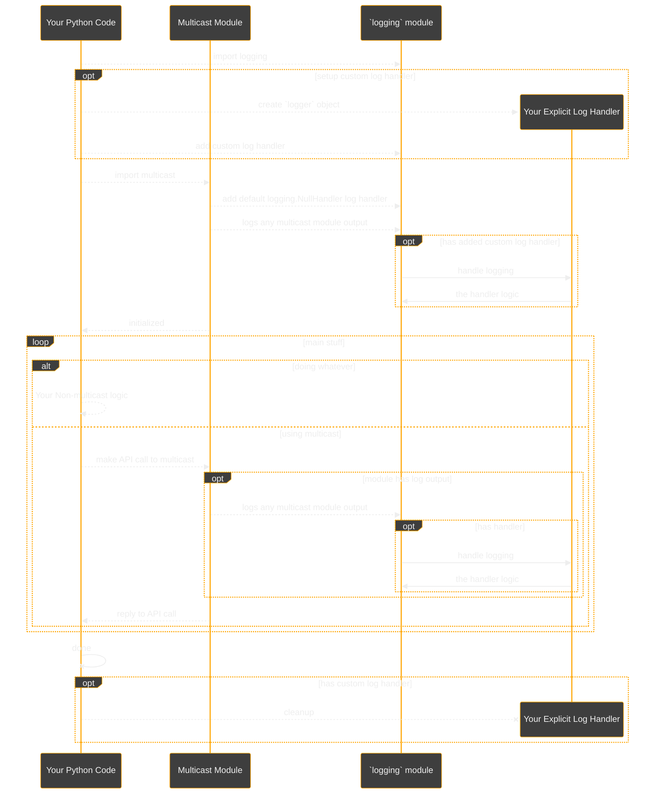

# FAQ

## Frequently Asked Questions

```{toctree}
:maxdepth: 3
:caption: Frequently Asked Questions
```

### Where can I find project policies and conventions?

* [LICENSE](https://github.com/reactive-firewall-org/multicast/tree/HEAD/LICENSE.md)
* [Code of Conduct](https://github.com/reactive-firewall-org/multicast/tree/HEAD/.github/CODE_OF_CONDUCT.md)
* [Contributing](https://github.com/reactive-firewall-org/multicast/tree/HEAD/.github/CONTRIBUTING.md)
  * [AI Usage Policy](https://github.com/reactive-firewall-org/multicast/tree/HEAD/.github/AI_USAGE_POLICY.md)
  * [Convention Enhancement Proposal No. 4](https://gist.github.com/reactive-firewall/cc041f10aad1d43a5ef15f50a6bbd5a5)
  * [Convention Enhancement Proposal No. 7](https://gist.github.com/reactive-firewall/123b8a45f1bdeb064079e0524a29ec20)
  * [Convention Enhancement Proposal No. 8](https://gist.github.com/reactive-firewall/b7ee98df9e636a51806e62ef9c4ab161)
  * [Convention Enhancement Proposal No. 9](https://gist.github.com/reactive-firewall/d840ee9990e65f302ce2a8d78ebe73f6)
* [Security](./SECURITY.md)

### How do I get this running?

To configure your environment for developing with the multicast library, follow the steps in the
[Install Guide](./INSTALL.md).
Key steps include:

  1. Ensuring you have a supported version of Python installed.
  2. Using pip to install (e.g., `pip install multicast`)
  3. Verifying the installation works:

  | _in `Python`_ | _in `bash`_ |
  |---------------|-------------|
  | `import multicast` | `python3 -m multicast --help` |

### How do I use this `multicast` to receive some UDP multicast?

With `multicast` installed and set up, this guide will assume you want to listen to multicast
group `224.0.0.1` on the UDP port `59595`.

#### _Prototype in `bash`_

This command will allow you to quickly prototype and test receiving multicast messages without
needing to write a full Python script. Once you confirm that the command works as expected, you
can then proceed to implement a more advanced solution in Python as necessary.

```bash
python3 -m multicast --daemon --use-std HEAR --port 59595 --group 224.0.0.1
```

* **Explanation of the Command-Line Options**  <!-- Not a header due to repeated usage -->

| Option | Description |
|--------|-------------|
| `--daemon` | This option runs the multicast listener as a background daemon. |
| `--use-std` | This specifies the action to take when any output is produced. In this case, it uses the standard output to print received messages instead of the default to just log messages. |
| `HEAR` | This specifies the action to take. In this case, it will _receive_ multicast. |
| `--port 59595` | This sets the UDP port number to `59595`, which is used to identify/filter the multicast messages that will be accepted. |
| `--group 224.0.0.1` | This specifies the multicast group address to join. You can replace `224.0.0.1` with your desired multicast group address. |

* **Steps to Run**  <!-- Not a header due to repeated usage -->

  1. Open your terminal.
  2. Ensure you have the multicast module installed and accessible.
  3. Run the command above, adjusting the port and group as needed for your specific use case.

Most users will want to stick to using `HEAR` when receiving multicast from the CLI. Alternatively,
users can use the ephemeral `RECV` _(by omitting the `--daemon` flag)_ to receive individual UDP
messages, no more than one message at a time.

> [!TIP]
> Caveat: `RECV` is much more useful if actually used in a loop, for example:
>
> ```bash
> while true ; do  # until user Ctrl+C interrupts
>     python3 -m multicast --use-std RECV --port 59595 --group 224.0.0.1 --groups 224.0.0.1
> done
> ```

#### _Develop in `Python`_

While the command line interface is useful for prototyping, the Python API is better for
the rest of the development process. So, once you are ready to proceed to implement a more advanced
solution in Python, you can import the `multicast` library module with the usual `import multicast`
logic.

### How do I use this to send UDP Multicast?

With `multicast` installed and set up, this guide will assume you want to send a message to
multicast group `224.0.0.1` on the UDP port `59595`.

#### _from the python module_

Sending is similar to listening, you create a sender and pass it the options, except that unlike
listeners and receivers, senders are always synchronous (e.g., allowing only one message per call).

```python3
from multicast import send

# Create a multicast sender
sender = send.McastSAY()

# Send a message
sender(group='224.0.0.1', port=59595, ttl=1, data='Hello, Multicast!')
```

#### _from the CLI_

```bash
python3 -m multicast SAY --group 224.0.0.1 --port 59595 --message "Hello World!"
```

* **Explanation of the Command-Line Options**  <!-- Not a header due to repeated usage -->

| Option | Description |
|--------|-------------|
| `SAY` | This specifies the action to take. In this case, it will _transmit_ multicast. |
| `--group 224.0.0.1` | This specifies the multicast group address to transmit messages to. You can replace `224.0.0.1` with your desired multicast group address. |
| `--port 59595` | This sets the UDP port number to `59595`, which is used by other members of the multicast group to help identify/filter the multicast messages to accept. |
| `--message` | This specifies the rest of the input is to be the message to transmit. |
| `"Hello World!"` | This specifies the multicast message content to _transmit_. In this case, it is the greeting "Hello World!" |

* **Steps to Run**  <!-- Not a header due to repeated usage -->

  1. Open your terminal.
  2. Ensure you have the multicast module installed and accessible.
  3. Run the command above, adjusting the message, port and group as needed for your specific use case.

This command will allow you to quickly prototype sending multicast messages without needing to
write a full Python script. You can test the sending functionality alongside the receiving
functionality to ensure that messages are being transmitted and received correctly.

### What is the basic `multicast` Python API?

> [!WARNING]
> Caveat: this example is still prototype focused, and should be considered a minimal
> implementation (e.g., lacks useful input validation, lacks error handling, etc.)

```python3
# Optional setup console logging
import logging
multicast_logging_sink = logging.getLogger()
multicast_logging_sink.setLevel(logging.INFO)  # increase default logging from multicast module
handler = logging.StreamHandler()  # example trivial log handler
multicast_logging_sink.addHandler(handler)

# imports
import multicast
from multiprocessing import Process
import random  # for random port

# Multicast group address and port
MCAST_GRP = "224.0.0.1"  # Replace with your multicast group address (use IPv4 dotted notation)
MCAST_PORT = int(random.SystemRandom().randint(49152, 65535))  # Replace with your multicast port

# Options for multicast listener
listener_options = {
    "is_daemon": True,  # bool: enable daemon mode
    "port": MCAST_PORT,  # int: UDP port for multicast
    "group": MCAST_GRP  # str: multicast group address (use IPv4 dotted notation)
}

# Create a multicast listener
listener = multicast.hear.McastHEAR()

# create a separate process for the listener
p = Process(
    target=listener,
    name="HEAR", kwargs=listener_options
)
p.daemon = listener_options["is_daemon"]
p.start()

# ... use CTL+C (or signal 2) to shutdown the server 'p'
```

Low-level with example handler:

```python3
# imports
import multicast
import random  # for random port
import functools  # for decorator func metadata

# Multicast group address and port
MCAST_GRP = "224.0.0.1"  # Replace with your multicast group address (use IPv4 dotted notation)
MCAST_PORT = int(random.SystemRandom().randint(49152, 65535))  # Replace with your multicast port

# Other important settings (Non-Multicast)
# Multicast does not care about the host IP, but the UDP protocol layer of the Python socket does
# There are 3 logical choices for the vast majority of users:
# 1. '0.0.0.0' for Promiscuous mode (Usually needs privileges to use on most Operating Systems)
# 2. The actual interface IPv4 dot notation address for unprivileged mode
# 3. None, Linux and MacOS implementations can let the system choose by passing the
#    MCAST_GRP to the Python socket.bind operation (handled by multicast.skt when missing Host IP)
#    Windows users must use option 1 or 2 for now.
# This address is per socket (e.g., can be chosen per socket even if on a single interface)

# Options for multicast listener
listener_options = {
    "is_daemon": False,  # bool: enable/disable daemon mode
    "groups": [MCAST_GRP],  # list[str]: multicast group addresses (use IPv4 dotted notation list)
    "port": MCAST_PORT,  # int: UDP port for multicast
    "iface": None,  # str: System specific interface name, or None to let system choose
    "group": MCAST_GRP  # str: primary multicast group address (use IPv4 dotted notation)
}

# Example setup for Low-Level use-case
# Define a decorator to loop until able to print a string result of enough length


def printLoopStub(func):
    @functools.wraps(func)
    def wrapper(*args, **kwargs):
        while True:
            # cache function result
            cache = func(*args, **kwargs)
            if cache and len(cache) > 1:
                print( str( cache ) )
                break
            elif not cache:
                continue
            else:
                print("Result is too short.")
    return wrapper


# Example low-level handler
# Define a decorated handler to only return successfully received messages


@printLoopStub
def inputHandler():
    # Create an ephemeral multicast receiver
    receiver = multicast.recv.McastRECV()
    # create an empty default string
    out_string = str()
    # try to receive some multicast messages
    (didWork, buffer_string) = receiver(
        **listener_options
    )
    # check the result and "handle" if successful
    if didWork:
        out_string += buffer_string
    del receiver  # optionally cleanup receiver beforehand
    return out_string


# create the actual handler instance
inputHandler()

```

_and elsewhere (e.g., in another module or even on another system); an example for the sender API:_

```python3
# imports
import multicast
from multiprocessing import Process

# Multicast group address and port
MCAST_GRP = "224.0.0.1"  # Replace with your multicast group address (use IPv4 dotted notation)
MCAST_PORT = int(59595)  # Replace with your multicast port (use the same port as the listeners)

# Other important settings (Non-Multicast)
# Multicast does not care about the host IP, but the UDP protocol layer of the Python socket does
# The sender will default to letting the system choose
# HOST_BIND_IP = "0.0.0.0"

# Options for multicast sender
sender_options = {
    "port": MCAST_PORT,  # int: UDP port for multicast
    "group": MCAST_GRP,  # str: multicast group address (use IPv4 dotted notation)
    "data": "Default listener only knows: STOP"  # str: message content to try to _transmit_
}

# Create an ephemeral multicast sender
sender = multicast.send.McastSAY()

# create a separate process for the sender
p = Process(
    target=sender,
    name="SAY", kwargs=sender_options
)
p.daemon = False  # sender should not be a daemon

try:
    p.start()
except Exception as baton:
    p.join()  # good practice to handle clean up
    raise RuntimeError("multicast seems to have failed.") from baton  # re-raise
finally:
    # clean up some stuff
    if p:
        p.join() # if not already handled don't forget to join the process and other overhead
    # hint: if you use a loop and need to know the exit code
    didWork = (p is not None and p.exitcode <= 0)  # e.g. check for success

```

> [!WARNING]
> Caveat: the above examples assume the reader is knowledgeable about general
> interprocess communication theory and the standard python `multiprocessing` module and its use.
> Together these examples demonstrate a trivial message passing IPC using multicast python sockets.

See also [USAGE Guide](./USAGE.md)

### Why does multicast module logging require explicit handler setup instead of just basicConfig?

The multicast module uses a null log handler by default as part of its logging architecture. This
means that simply calling `logging.basicConfig(level=logging.INFO)` is insufficient to display the
`multicast` module's log records, as there's no active handler to capture and output them.

To see multicast module logging output, you must explicitly add a log handler:



#### Required approach - explicit handler setup

> [!IMPORTANT]
> `logging` must be set up _before_ importing `multicast` otherwise the `NullHandler` set up by
> `multicast` will be first and still be-able to intercept the module's `logging.LogRecords` just
> as it normally would.

```python3
import logging
multicast_logging_sink = logging.getLogger()
multicast_logging_sink.setLevel(logging.INFO)  # optional, otherwise the module is very quiet
handler = logging.StreamHandler()  # replace with your explicit handler
multicast_logging_sink.addHandler(handler)
```

This explicit setup ensures that:

* The log level is set appropriately (e.g., `logging.INFO`)
* An active handler (e.g., `StreamHandler`) is added to capture module log records
* The multicast module's log output becomes visible to users
* While logging.basicConfig() might seem simpler, it won't work with the multicast module's logging
  architecture and will result in no visible log output from the library.

### How do I run and interpret the test suite for this project?

To run the test suite, follow the instructions in the [Testing Guide](./Testing.md).

The guide explains test organization, and how to run tests outside CI/CD.

### How is continuous integration (CI) set up for this repository?

CI is configured as described in the [CI Guide](./CI.md).
Key points:

Automated builds and tests are run via GitHub Actions. Each pull request is tested for
compatibility and code quality. The guide details the CI workflow files, environment variables,
and what to expect when contributing changes.

### What are the defaults?

#### Default Multicast Group

> [!IMPORTANT]
> The **default** multicast group address is `224.0.0.1`.

From the
[API documentation](https://github.com/reactive-firewall-org/multicast/blob/v1.4/multicast/__init__.py#L185-L187):
> The Value of "224.0.0.1" is chosen as a default multicast group as per RFC-5771
> on the rational that this group address will be treated as a local-net multicast
> (caveat: one should use link-local for ipv6).

#### Default Multicast Bind Address

> [!NOTE]
> The **default** multicast bind address is the **default** group. This is effectively `224.0.0.1`.

#### Default TTL

> [!IMPORTANT]
> The **default** multicast Time-to-Live (TTL) is `1`.

From [RFC-1112 §6.1](https://www.rfc-editor.org/rfc/rfc1112#section-6.1)
> ... If the
> upper-layer protocol chooses not to specify a time-to-live, it should
> default to 1 for all multicast IP datagrams, so that an explicit
> choice is required to multicast beyond a single network.

From the
[API documentation](https://github.com/reactive-firewall-org/multicast/blob/v1.4/multicast/__init__.py#L214-L217):
> A Value of 1 (one TTL) is chosen as per
> [RFC-1112 §6.1](https://www.rfc-editor.org/rfc/rfc1112#section-6.1) on the rational that an
> explicit value that could traverse beyond the local connected network should be
> chosen by the caller rather than the default value. This is in line with the principle
> of none, one or many.

#### Default Port

> [!IMPORTANT]
> The **default** UDP port used by `multicast` is `59595`.

From the
[API documentation](https://github.com/reactive-firewall-org/multicast/blob/v1.4/multicast/__init__.py#L155):
> Arbitrary port to use by default, though any dynamic and free port would work.

While developers and network administrators must consider other factors in real-world deployments,
it is fair to say any free port in the dynamic or "ephemeral" port range of `49152`-`65535` should
work as far as the `multicast` module is concerned.

* For `SAY` the port refers to the destination port.
* for `RECV` and `HEAR` the port refers to the port to listen on.

> [!CAUTION]
> It is best to specify the port in use at this time, as the default will not be properly
> assigned to `multicast` ( see related reactive-firewall-org/multicast#62 ) by any central
> authority.

### CLI exit code meanings

`0` **success**

`1` **non-success** - and is often accompanied by warnings or errors

`2`-`225` **failure** of specific reason

* Any exit value outside the range of `0-255` inclusive should be decoded with the formula:
  `| input % 256 |` which will yield the correct exit code.

> [!NOTE]
> These are inline with
> [CEP-8](https://gist.github.com/reactive-firewall/b7ee98df9e636a51806e62ef9c4ab161)'s
> POSIX-based guidelines.

### How do I build the documentation?

* Typically, the documentation will be automatically built by CI/CD and posted to the official
  documentation site.

* However, if one still wishes to build the documentation manually, there is a `make` target
  specifically for building from source:

  ```bash
  make build-docs
  ```

### Building Documentation with a Custom Git Reference

  By default, the documentation links to the `stable` branch on GitHub. To override this and link
  to the specific commit you're working on, set the `DOCS_BUILD_REF` environment variable:

  ```bash
  # git clone ...
  # git checkout <specific commit>
  # shellcheck disable=SC2155
  export DOCS_BUILD_REF=$("${GIT:-git}" rev-parse --verify HEAD)
  make build-docs  # or your own documentation build command
  ```

  This command dynamically sets `DOCS_BUILD_REF` to the current Git commit hash, ensuring that
  documentation links point to the exact version of your code.

***

#### Copyright (c) 2021-2025, Mr. Walls

[](https://github.com/reactive-firewall-org/multicast/tree/HEAD/LICENSE.md)
