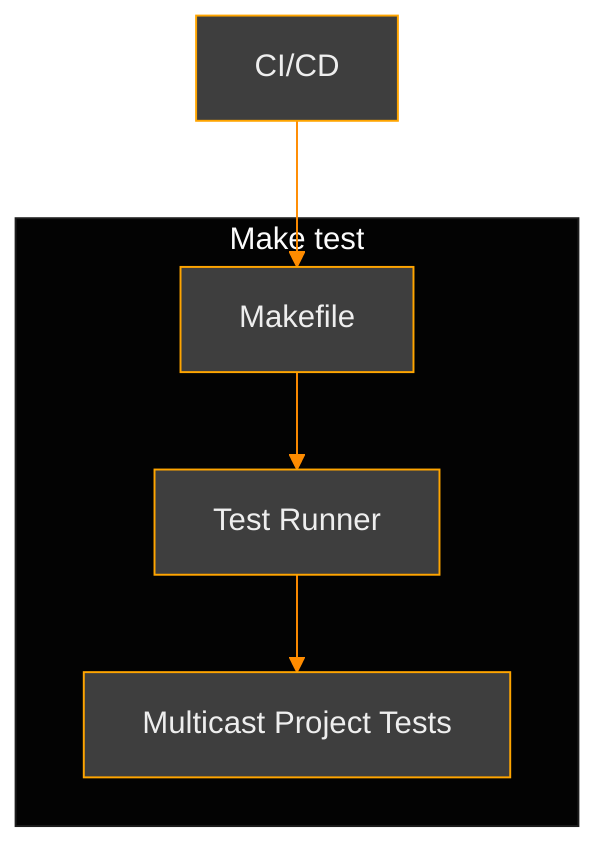
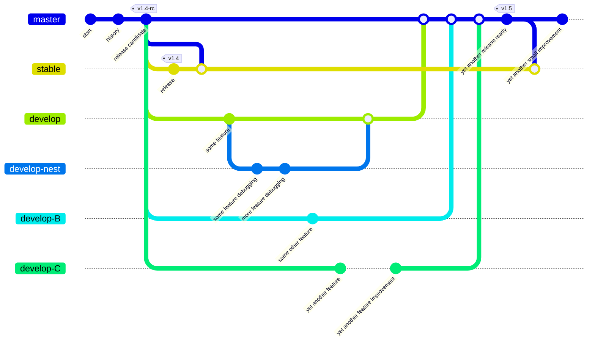
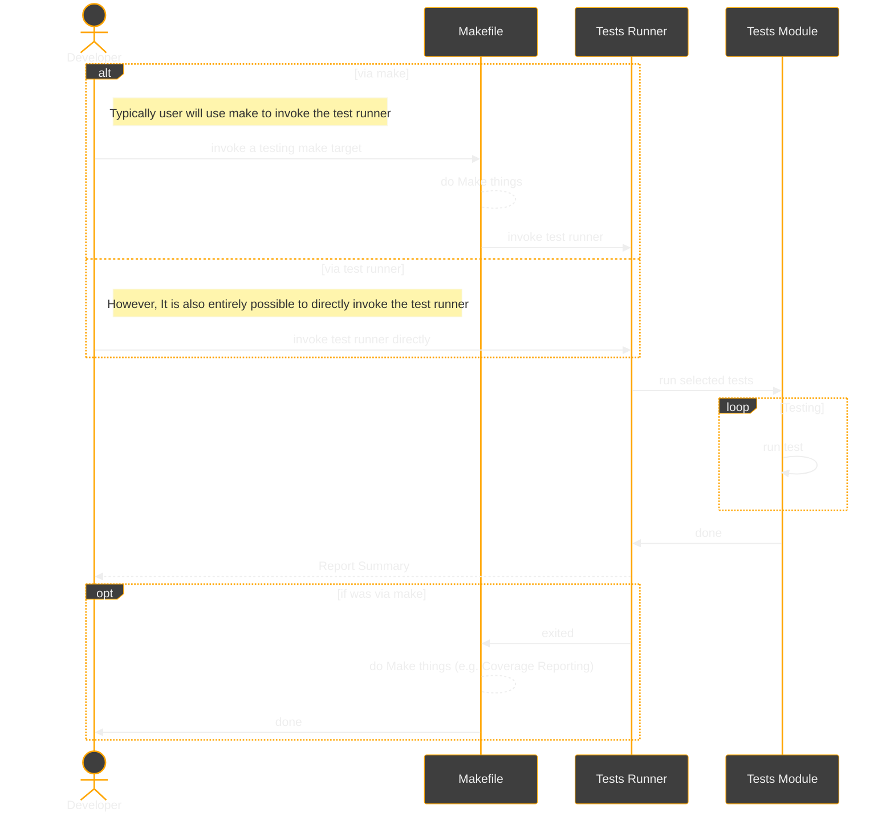
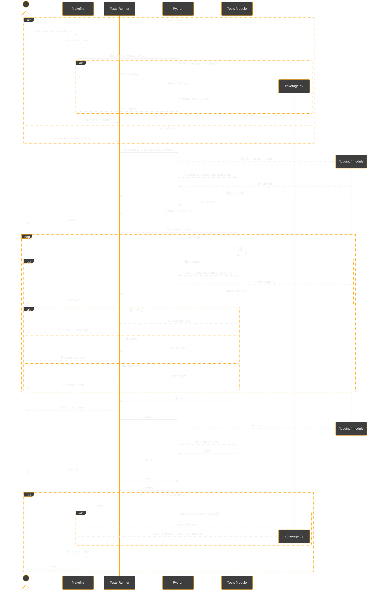

# Testing

Details about the Multicast project's own testing.

***

> [!CAUTION]
> Multicast project testing code is under an MIT license like the Multicast module; however
> the project's Testing can use tools which are split between multiple licenses.
> While all the source-code is open-source, using some of the project test code is only possible
> in an environment where additional restrictions apply, due to third-party licensing which is
> incompatible if it were to be included with the rest of the project.
>
> Certain Continuous Integration/Continuous Deployment (CI/CD) tools may require GNU licensed
> software to operate effectively. These are _not_ included in the project.
> Environment Compatibility: Users must ensure that their testing environments are equipped
> with the necessary components and licenses to run the testing code. This is akin to a
> "batteries not included" disclaimer, indicating that additional setup may be required.
> AS-IS Disclaimer: Please note that the Multicast project is provided "AS-IS," and we do not
> guarantee compatibility or support for the testing code outside of the specified environments.
> Users are responsible for ensuring compliance with all applicable licenses and for setting up
> their environments accordingly.

***

> [!IMPORTANT]
> Multicast project testing is intended for CI/CD but can also be initiated
> manually (e.g., in your local environment) with the bash command: `make test-mats` or
> just `make test` and can be reset before and after with: `make clean` and `make purge`.

You can find all the testing code in the aptly named `tests/` directory.

* Unit-testing is primarily done with the `unittest` framework.
* Functional testing is done via additional checks, including an end-to-end check invoking an
  actual pair of processes to test that `SAY` and `HEAR` indeed work together.

You can find additional custom testing automation tooling in the aptly named `tools/` directory
inside the `.github` directory (e.g., `.github/tools`).

* The custom scripts for handling various tasks in CI/CD are also located in `.github/tools`
  * Also see [CI Documentation](CI.md)
  * Also see [CEP-5](https://gist.github.com/reactive-firewall/3d2bd3cf37f87974df6f7bee31a05a89)

## Test Groups

### MATs

> [!IMPORTANT]
> Minimal acceptance tests are also automated as part of the CI processes, and run
> for each push to the repository. Minimal acceptance testing is run across multiple versions of
> Python to ensure stable behavior across a wide range of environments.

Minimal Acceptance Tests (MATs) are the bare minimum set of tests that must be successful for the
Multicast project to be considered acceptable.

#### CI/CD MATs

| Trigger | Workflow |
|---------|----------|
| `uses: .github/actions/run-minimal-acceptance-tests` | [.github/actions/run-minimal-acceptance-tests/action.yml](https://github.com/reactive-firewall-org/multicast/tree/HEAD/.github/actions/run-minimal-acceptance-tests/action.yml) |

#### Manual MATs

1. Clone a [development build](https://github.com/reactive-firewall-org/multicast/tree/patch-readme-docs?tab=readme-ov-file#developer-builds)

2. Invoke the MATs test target.

```bash
make test-mats
```

#### Categories

Currently, MATs are comprised of the test categories `bootstrap`, `basic`, `build`, `doctests`,
`say`, `hear`, and `usage`.

| Category | Criteria | _TestSuites_ |
|----------|----------|--------------|
| `bootstrap` | Tests the basic function of initializations, exceptions, environment, and the `skt` component | [test_exceptions.ExceptionsTestSuite](https://github.com/reactive-firewall-org/multicast/blob/HEAD/tests/test_exceptions.py) |
| `basic` | Tests the trivial functions of initializations, exceptions, and environment | [test_basic.BasicTestSuite](https://github.com/reactive-firewall-org/multicast/blob/HEAD/tests/test_basic.py) |
| `build` | Tests the build and packaging support | [test_build.BuildPEP517TestSuite](https://github.com/reactive-firewall-org/multicast/blob/HEAD/tests/test_build.py), [test_build.BuildPEP621TestSuite](https://github.com/reactive-firewall-org/multicast/blob/HEAD/tests/test_build.py), [test_manifest.ManifestInclusionTestSuite](https://github.com/reactive-firewall-org/multicast/blob/HEAD/tests/test_manifest.py), ~[test_install_requires.ParseRequirementsTestSuite](https://github.com/reactive-firewall-org/multicast/blob/v2.0.8/tests/test_install_requires.py)~ (_removed in v2.0.9a3_) |
| `doctests` | Tests the doctests found in the `multicast` codebase | [multicast.__docs__](https://github.com/reactive-firewall-org/multicast/blob/HEAD/multicast) |
| `say` | Tests focused on `multicast/send.py` | [test_usage.MulticastTestSuite](https://github.com/reactive-firewall-org/multicast/blob/HEAD/tests/test_usage.py) |
| `hear` | Tests focused on `multicast/recv.py` and `multicast/hear.py` | [test_hear_server.McastServerTestSuite](https://github.com/reactive-firewall-org/multicast/blob/HEAD/tests/test_hear_server.py), [test_hear_server.HearUDPHandlerTestSuite](https://github.com/reactive-firewall-org/multicast/blob/HEAD/tests/test_hear_server.py), [test_hear_server_activate.McastServerActivateTestSuite](https://github.com/reactive-firewall-org/multicast/blob/HEAD/tests/test_hear_server_activate.py), [test_hear_data_processing.RecvDataProcessingTestSuite](https://github.com/reactive-firewall-org/multicast/blob/HEAD/tests/test_hear_data_processing.py), [test_hear_data_processing.HearHandleNoneDataTestSuite](https://github.com/reactive-firewall-org/multicast/blob/HEAD/tests/test_hear_data_processing.py), [test_hear_cleanup.HearCleanupTestSuite](https://github.com/reactive-firewall-org/multicast/blob/HEAD/tests/test_hear_cleanup.py) |
| `usage` | Tests focused on `multicast/__main__.py` and API use-cases | [test_usage.BasicIntegrationTestSuite](https://github.com/reactive-firewall-org/multicast/blob/HEAD/tests/test_usage.py) |

### Advanced Testing

> [!NOTE]
>
> #### TL;DR - Contributor Focused
>
> The rest of this document is focused on topics that are intended only for those who wish to
> contribute (_or perhaps those few readers who are driven by an insatiable thirst for knowledge,
> and are here to delve into topics purely for the joy of learning_).

#### The Test Runner

The test runner is an obscure part of the Multicast project testing process, albeit an
important part. In general, a test runner is what it sounds like; the component responsible
for running the various tests during the act of testing.

> [!IMPORTANT]
> Both CI/CD and the Makefile ultimately use the same test runner under the hood.



##### Contributor Context

Unlike the case of using `multicast` as a dependency for another project (e.g., the typical case),
contributors are instead modifying `multicast`.

Feature development and non-security related bug fixes are done on development branches and
then merged into the
[default branch (master)](https://github.com/reactive-firewall-org/multicast/blob/master/) for further
integration testing. This ensures the
[release branch (stable)](https://github.com/reactive-firewall-org/multicast/blob/stable/) remains
acceptable for production use.



##### Test-Driven Contributors

During the development cycle new features will also need testing (this is mentioned in detail
by the [Contributing Guidelines](https://github.com/reactive-firewall-org/multicast/tree/HEAD/.github/CONTRIBUTING.md).
This is where the otherwise undocumented Selective Test Runner [`run_selective.py`](https://github.com/reactive-firewall-org/multicast/tree/HEAD/tests/run_selective.py),
comes into play. While the test runner is used by much of the project automation to run all kinds
of tests, it is the most powerful when used to skip tests to save time iteratively developing a
new feature.

Consider the following special-cases where both CI/CD testing, and/or local `make test` testing
methods are unsuited:

* developing new features that yet to have their new tests implemented
  * while a successful CI/CD (including coverage thresholds) is an important indicator that there
    are no regressions, it does not provide feedback for the new features directly.
  * only tests that regressed are ever of any actionable use
  * and even tests that regressed may actually be false-positives, depending on the feature
* developing new tests
  * checking more than just the new tests, until the new tests are passing, is inefficient.

These and similar cases can benefit from the improved granularity of targeted testing provided by
the selective test runner. Of course, eventually the process leads back to the normal CI/CD
testing.



#### Testing with Fuzzing

The Multicast Project includes some source-code to allow extra fuzzing when additional dependencies
are present.

> [!IMPORTANT]
> To effectively leverage the source code for performing fuzzing, you must install a licensed
> copy of the 'hypothesis' Python module.

There is a separate test group for optional fuzz testing aptly named `fuzzing`. Currently, the
`fuzzing` test group contains only one category named `slow`.

| Category | Criteria | _TestSuites_ |
|----------|----------|--------------|
| `slow` | _Optionally_ tests fuzzing `multicast` while ignoring test performance | [test_fuzz.HypothesisTestSuite](https://github.com/reactive-firewall-org/multicast/tree/HEAD/tests/test_fuzz.py) _Assuming it is present_ |

#### Testing Performance

The Multicast Project includes some hooks for automating future performance testing.

> [!NOTE]
> Current performance testing is ad-hoc and focused on gathering more profiling data.

There is a separate test group intended for future performance testing aptly named `performance`.
Currently, the `performance` test group contains only empty categories named `scalability`,
`multi_sender`, and `multi_receiver`.

| Category | _Intended_ Criteria | _TestSuites_ |
|----------|---------------------|--------------|
| `scalability` | Tests performance scaling | _Empty_ |
| `multi_sender` | Tests performance with multiple senders | _Empty_ |
| `multi_receiver` | Tests performance with multiple listeners | _Empty_ |

#### Testing even more

The Multicast Project includes some extra tests intended for additional, but non-acceptance,
testing (e.g., test for covering defensive or debugging code). These extra tests are organized
together under the aptly named group `extra`. The `extra` group contains the categories `coverage`,
`linting`, and `security`.

| Category | _Intended_ Criteria | _TestSuites_ |
|----------|---------------------|--------------|
| `coverage` | Test for covering defensive or debugging code | [test_deps.BuildRequirementsTxtTestSuite](https://github.com/reactive-firewall-org/multicast/tree/HEAD/tests/test_deps.py), [test_hear_keyboard_interrupt.TestHearKeyboardInterrupt](https://github.com/reactive-firewall-org/multicast/tree/HEAD/tests/test_hear_keyboard_interrupt.py), [test_recv.McastRECVTestSuite](https://github.com/reactive-firewall-org/multicast/tree/HEAD/tests/test_recv.py) |
| `linting` | Tests for code structure and style | _Empty_ |
| `security` | Tests related to secure coding practices | [test_extra.ExtraDocsUtilsTestSuite](https://github.com/reactive-firewall-org/multicast/tree/HEAD/tests/test_extra.py) |

##### Coverage

The Multicast project uses CI/CD to ensure constant and comprehensive testing. `coverage` in the
`extra` group's context is referring to "extra test coverage".

> [!TIP]
> Contributors who are unsure of how to categorize their new test code, may fall back to the
> `coverage` category, so not to get bogged down before code review, where the categorization
> can better be discussed.

##### Linting

The Multicast project uses CI/CD to ensure all files, including code, configurations, and
documentation, are linted before publishing releases. This is automatically triggered by
pull requests during the project's release workflow, namely before merging anything to the
branch `master`, and again before releasing to `stable`.

> [!WARNING]
> Locally, linting is limited as many linters are copyleft restricted and can never be bundled with
> the rest of the MIT licensed code.

See implementation for more details.

> [!TIP]
> Want to check multicast python code style? Great! Try this:
>
> ```bash
> make clean ; # cleans up from any previous tests hopefully
> make test-style ; # runs the project's tests for style
> make clean ; # cleans up for next test
> ```

#### Logging and Coverage testing

By default, logging from the `multicast` module is ignored (there is a [default NullHandler](https://github.com/search?q=repo%3Areactive-firewall%2Fmulticast%20path%3Amulticast%2F*.py%20%22addHandler(logging.NullHandler())%22&type=code)
). The test-runner [`run_selective.py`](https://github.com/reactive-firewall-org/multicast/tree/HEAD/tests/run_selective.py)
inserts its own [special log handler](https://github.com/search?q=repo%3Areactive-firewall%2Fmulticast+path%3Atests%2F*.py+ColoredStreamHandler)
during testing to assist in debugging. Code coverage is only collected when invoking tests via the
[`Makefile`](https://github.com/reactive-firewall-org/multicast/tree/HEAD/Makefile) targets that
support it (and of course, only if already installed).

> [!TIP]
> Code coverage can leave numerous artifacts after testing, so it is a good idea to run the
> `make clean` target when finished with each test run to blow away such coverage artifacts.

Here is how `multicast` module logging and code coverage collection are integrated into the
whole testing process.



#### As a Dependency, Testing

The test code for CI/CD is not included with the built Python module `multicast`. Currently, there
is no plan to change this. The Python module `tests` does not need to be installed, so there is
no practical use for including it in build artifacts. Also see relevant "AS-IS" disclaimers in
[`LICENSE.md`](https://github.com/reactive-firewall-org/multicast/tree/HEAD/LICENSE.md).

> [!TIP]
> In a rush to test this module in your own environment? Then you might try this:
>
> ```bash
> #cd /MY-AWESOME-DEV-PATH/multicast || git clone ...
> make clean ; # cleans up from any previous tests hopefully
> make test ; # runs the tests
> make clean ; # cleans up for next test
> ```

***

#### Copyright (c) 2021-2025, Mr. Walls

[](https://github.com/reactive-firewall-org/multicast/tree/HEAD/LICENSE.md)

_Dependencies NOT included._
