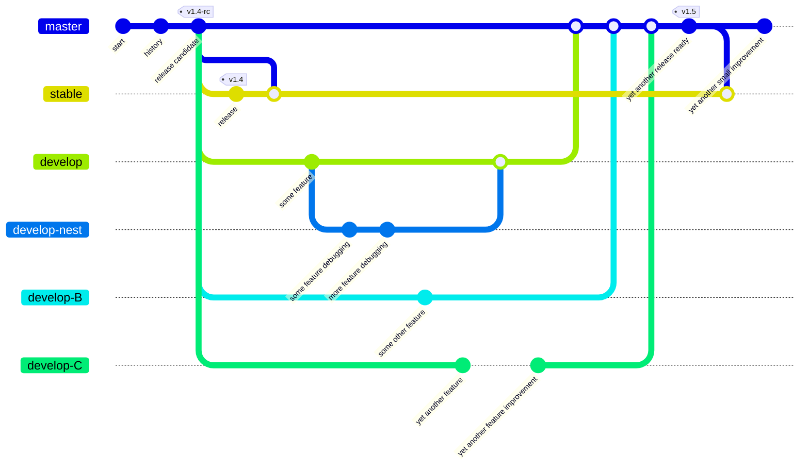

# Testing

Details about the Multicast project's own testing.

***

> [!WARNING]
> Multicast project testing code is not under a unified license like the Multicast module; rather
> the project is split between multiple licenses. While all of the sourcecode is open-source,
> using some of the project test code is only possible in an environment where additional,
> restrictions apply, due to third party licencing which is incompatable if it were to be included
> with the rest of the project, most notably when using the `extra` tests and some CI/CD tooling.

***

> [!IMPORTANT]
> Multicast project testing is intended for CI/CD but can also be initiated
> manually (eg. in your local environment) with the bash command: `make test-mats` or
> just `make test` and can be reset before and after with: `make clean` and `make purge`.

You can find all the testing code in the aptly named `tests/` directory.

* Unit-testing is primarily done with the `unittest` framework.
* Functional testing is done via additional checks, including an end-to-end check invoking an
  actual pair of processes to test that `SAY` and `HEAR` indeed work together.

You can find additional custom testing automation tooling in the aptly named `tools/` directory
inside the `.github` directory (eg. `.github/tools`).

* Unit-testing is primarily done with the `unittest` framework.
* Functional testing is done via additional checks, including an end-to-end check invoking an
  actual pair of processes to test that `SAY` and `HEAR` indeed work together.

### MATs

Minimal acceptance testing is run across multiple versions of Python to ensure stable behavior
across a wide range of environments. MATs are also automated as part of the CI processes, and run
for each push to the repository.
Feature development and non-security related bug fixes are done on development branches and
then merged into the
[default branch (master)](https://github.com/reactive-firewall/multicast/blob/master/) for further
integration testing. This ensures the
[release branch (stable)](https://github.com/reactive-firewall/multicast/blob/stable/) remains
acceptable for production use.



### Linting

The Multicast project uses CI/CD to ensure all files, including code, configurations, and
documentation, are linted before publishing releases. This is automatically triggered by
pull requests during the project's release workflow, namely before merging anything to the
branch `master`, and again before releasing to `stable`.

#### Linting Badges

[](https://github.com/reactive-firewall/multicast/actions/workflows/codeql-analysis.yml)
[](https://github.com/reactive-firewall/multicast/actions/workflows/markdown-lint.yml)
[](https://github.com/reactive-firewall/multicast/actions/workflows/yaml-lint.yml)
[](https://github.com/reactive-firewall/multicast/actions/workflows/makefile-lint.yml)

### As a Dependency, Testing

> [!TIP]
> In a rush to get this module working? Then try using this in your own test workflow

```bash
#cd /MY-AWESOME-DEV-PATH/multicast || git clone ...
make clean ; # cleans up from any previous tests hopefully
make test ; # runs the tests
make clean ; # cleans up for next test
```

> [!TIP]
> Want to check multicast python code style? Great! Try this:

```bash
make clean ; # cleans up from any previous tests hopefully
make test-style ; # runs the project's tests for style
make clean ; # cleans up for next test
```

***

#### Copyright (c) 2021-2025, Mr. Walls

[](https://github.com/reactive-firewall/multicast/blob/stable/LICENSE.md)

_Dependencies NOT included._
